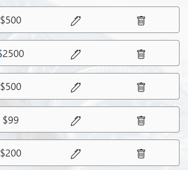

# Money Flow App 
  
## Intro

- Esta app fue realizada para el challenge de ingreso a Alkemy Labs "JavaScript Full Stack"
- Tiempo de desarrollo: 2 días. 
- Consigna: "Desarrollar una aplicación para administración de presupuesto personal. La misma debe
permitir crear y editar ingresos y egresos de dinero, y mostrar un balance resultante de las
operaciones registradas. Los datos mostrados deben ser persistidos en una base de datos relacional. El esquema de
datos puede armarse según se considere apropiado en base a los requerimientos del
negocio. La API deberá exponer URLS que devuelvan datos en JSON."

> Realizado utilizando el stack de tecnologías HTML, CSS, Javascript, React, Redux, Node.JS, Express, Sequelize y PostgreSQL.

## Last Movements

  

- La pantalla de inicio deberá mostrar el balance actual, es decir, el resultante de los ingresos y egresos de dinero cargados, y un listado de los últimos 10 registrados.

## All Movements

  

- Listado de todas las operaciones registradas, con capacidad de filtrarlas por tipo y/o categoría.

  

- Formulario de registro de operación. El mismo deberá contener:
○ Concepto
○ Monto
○ Fecha
○ Tipo (ingreso o egreso)

  

- Desde el listado, se debe poder modificar o eliminar una operación registrada previamente.

  

- No debe ser posible modificar el tipo de operación (ingreso o egreso) una vez creada.

> Adicionalmente se completó la asignatura de "Bonus" que solicitaba una tabla adicional de "categorías" relacionada adecuadamenete a los movimientos.